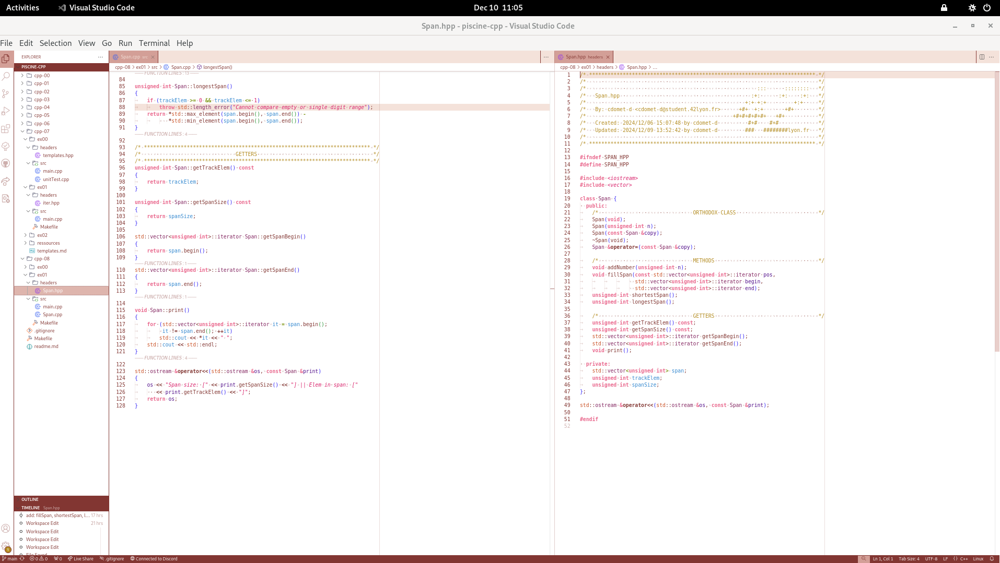

# Scripts and utils: a few tools to make your life easier.

Sometimes, programming gets pretty repetitive. Here are some of the scripts I wrote while studying at 42 to streamline some processes. Enjoy !

# Scripts

<details>

<summary> Class File Creation (create class) </summary>
Automates the creation of a basic C++ project structure, including 'headers' and 'src' directories, and generates .hpp and .cpp files for class names given as arguments.

It is meant to be aliased and used directly in your directory (see [aliasing](#aliasing)). Keep in mind that aliasing needs to be done in your shell configuration file - for me it was zsh, but maybe you're using bash or something else.

### Features

- Creates 'headers' and 'src' directories if they don't exist
- Generates .hpp and .cpp files for each provided class name
- Ensures class names start with an uppercase letter
- Prevents overwriting existing files

### Usage

1. Make the script executable:

```bash
	chmod +x script_name.sh
```

2. Run the script with class names as arguments:

```bash
	bash ./create_class ClassName1 ClassName2 ClassName3
```

### Behavior

- If 'headers' or 'src' directories already exist, the script will notify you.
- For each provided class name:
  - If files already exist, it will notify you.
  - If the class name doesn't start with an uppercase letter, it will show an error.
  - Otherwise, it creates both .hpp and .cpp files in their respective directories.

### Error Handling

- Displays an error if no arguments are provided.
- Notifies if directories or files already exist.
- Warns if a class name doesn't start with an uppercase letter.

</details>

<details>
<summary> Function Extractor Script (exf) </summary>

## Overview
This Bash script is designed to generate a header file based on your C source code. It ignores static declarated functions. You can specify a directory from which to extract the prototypes.

### Features

- Recursively searches for .c files in a given directory
- Extracts non-static function signatures
- Organizes output by directory and filename
- Saves extracted functions to an output file

### Prerequisites

- Bash shell
- Basic Unix/Linux environment
- grep, find, basename, dirname utilities

## Usage

```bash
	chmod +x exf
	bash exf

	# search within a directory
	bash exf dir/to/search
```
## Output

- Functions are saved in scripts/output/header
- Output includes:
	- Directory separators
	- Filename headers
	- Function signatures

```c
// src ------------------------------------ > directory in which file was found
/* file1.c > file from which the function was extracted */ 
int	main(int argc, char *argv[]);
void	helper_function(const char *param);
```

## Limitations

- Works best with standard C function declarations
- May not perfectly parse complex function prototypes
- Your code must be up to Norme in order for the script to work.
- Requires well-formatted source code

In order for the script to pick up on your prototypes, they must be formatted as follows

`[a-z].*	.*[a-z].*\([^)]*\)`

which means : 

- any number of lowercase letters followed by a **tab**, followed by any number of lowercase letters;
- you must have opening and closing parenthesesis at some point.
</details>

# Aliasing

To create an alias for this script in your .zshrc file:
> if you are not using zsh, you will need to check out how to alias for your own shell.
1. Open your .zshrc file (usually at the root of your session (`~/`)):

```bash
	vim ~/.zshrc
```

2. Add the following line (replace `/path/to/script.sh` with the actual path):
   > you can make the alias name anything you want

```bash
	alias cclass='bash ~/path/to/script_name'
```

3. Save the file and exit the editor.

4. Reload your .zshrc file:

```bash
source ~/.zshrc
```
Now you can use the alias to run the script from anywhere!

# vscode-config

In that folder, you will find:
- My vscode theme, which is high contrast and light (see preview below). It is easy to modify should you want to. [Look up how to develop a custom VsCode Theme](https://code.visualstudio.com/docs/getstarted/themes#_customize-a-color-theme).
- Two [code snippets](https://code.visualstudio.com/docs/editor/userdefinedsnippets): 
	- One to generate canonical classes in CPP98, 
	- One to generate file-appropriate header guards.



